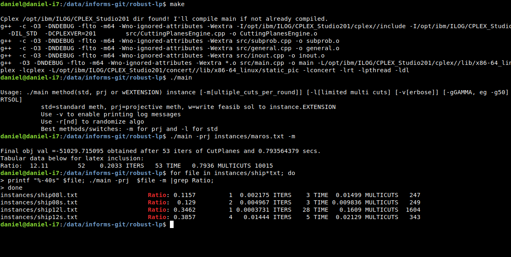
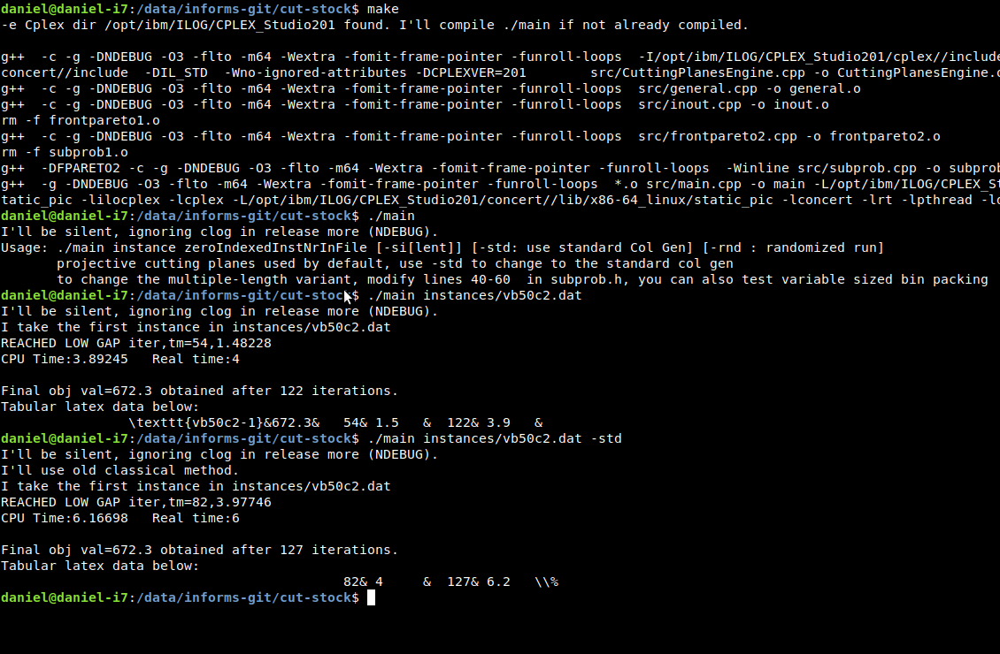

[](https://pubsonline.informs.org/journal/ijoc)

# Projective Cutting-Planes for robust linear programming and Cutting-Stock problems

## Cite

The final version of this repository, with updated bibliographical information, is available at [GitHub](https://github.com/INFORMSJoC/2020.0068).

## Description

The goal of this software is to demonstrate the efficiency of the proposed method (Projective Cutting Planes) on two problems

1. Robust Linear Programming
2. Cutting Stock with multiple lengths
    
The code for the first problem is in the `robust-lp` folder.
The code for the second one is in the `cut-stock` folder.

## Building

For both problems, you can build the executable by typing:
```
make 
```

Be sure to make clean before building a different version of the code.
```
make clean
```

## Results and replicating

Figure 1 shows a running example of the robust linear programming problem. The last three lines show how we generated the results from Table 2 (with gamma=10) for the three instances that have a name starting with `ship`.



Figure 2 shows a running example of the multiple-lenght cutting stock software.



You should obtain the same results if you type the same commands, although using
a different Cplex version may lead to slightly different figures.

## Ongoing Development

This code is being developed on an on-going basis at a private 
github. Copies for the latest code source may be addressed to
daniel.porumbel@cnam.fr.

## Support

For support in using this software, submit an
[issue](https://github.com/tkralphs/JoCTemplate/issues/new).
